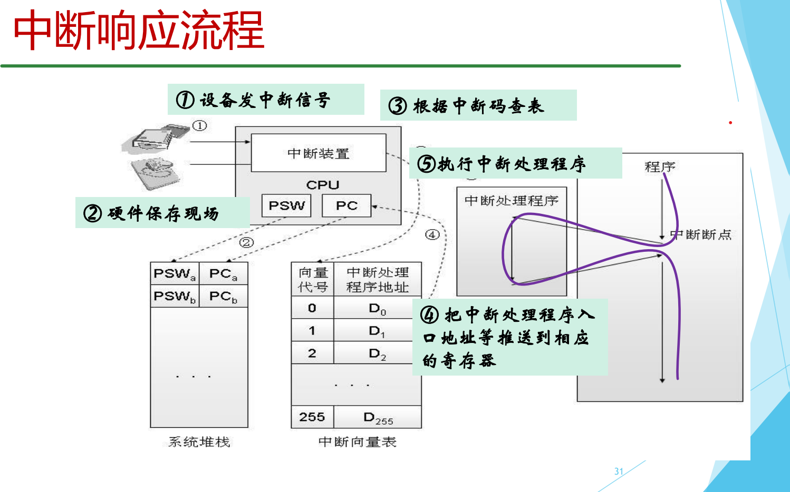

# Lab 4: Traps

### 关于xv6的中断、异常处理

##### 省流版

出现中断/异常的时候，硬件直接给你跳转到处理函数入口。然后等着处理函数帮你干完所有的活。

##### XV6的处理函数

在操统PPT上提到，常规的操作系统有个中断向量表，查这个表可以知道对应中断/异常的处理函数入口。

XV6没有这个表。

所有的中断/异常都是由两个函数负责的。用户态的全部由usertrap()负责，内核态的全部由kerneltrap()负责。两个函数完全独立，不会互相调用，各处理各的。（很多相似的代码写两遍，xv6它就是这么做了）

##### XV6中断/异常处理的完整底层流程

x86指令集要求stval寄存器内的值必须是中断处理程序的入口地址。

① 在每个CPU周期末尾，CPU硬件检查是否有中断or异常，如果有，将PC跳转到stval寄存器记录的地址（处理中断/异常的代码）。

用户态的时候，stval的值永远被设置成trampoline.S里uservec汇编代码段的位置。内核态的时候，stval的值永远被设置成kernelvec.S里kernelvec汇编代码段的位置。切换用户态/内核态的时候，stval的值会被相应地设置。

② 处理程序干的事：

uservec汇编代码所做的事情如下：先保存上下文（所有寄存器的值）；然后跳转到usertrap()函数。usertrap()函数不返回，直接进入usertrapret()函数。usertrapret()函数也不返回，直接跳转到userret汇编代码，这段汇编代码恢复上下文，然后回到用户态。

kernelvec汇编代码所做的事情如下：保存上下文；调用kerneltrap()函数；处理完中断后返回kernelvec汇编代码，恢复刚才保存的上下文；最后返回原来的位置（从哪来回哪去）。

##### 另外：

中断/异常和进程通信的信号没任何关系。它们压根不是一个范畴。中断/异常每个CPU周期检查一次，由硬件调动软件处理。进程之间的信号隔一段时间检查一次，完全由操作系统负责，和硬件更是半毛钱关系没有。
